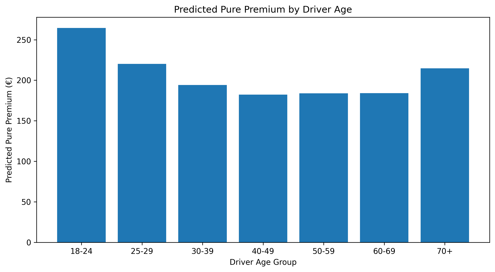
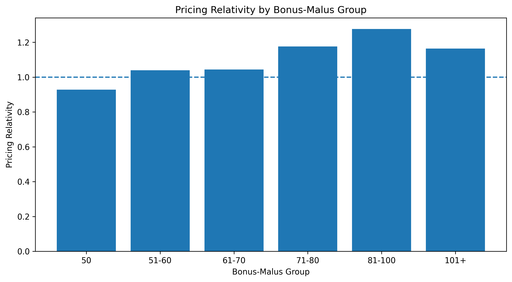
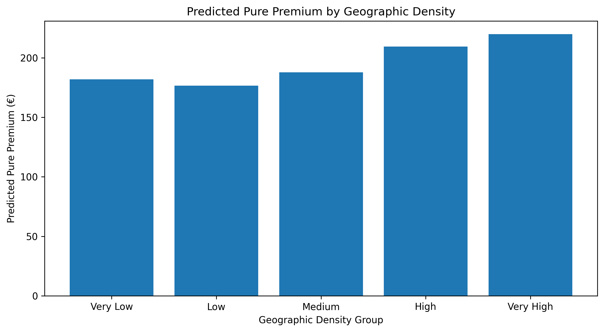
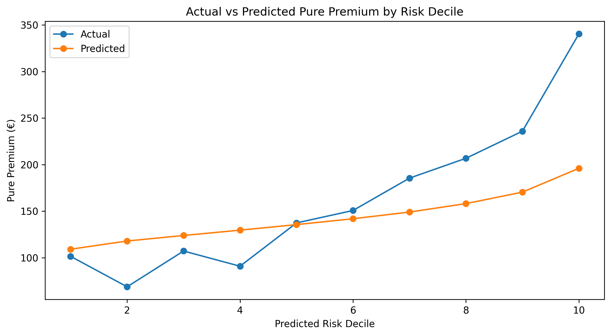
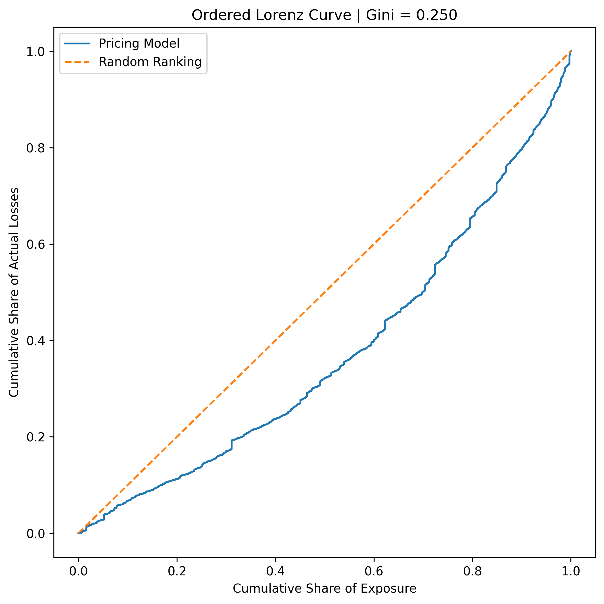

# Automobile Insurance Pricing Analysis

### Python Frequency-Severity Modeling + Automated Excel Pricing Dashboard

An end-to-end actuarial pricing portfolio project built on **678,013 automobile insurance policies**. The analysis separates claim frequency and claim severity using **Poisson** and **Gamma** regression models, combines those predictions into policy-level pure premiums, validates performance on holdout data, and publishes the results to an automated Excel pricing dashboard.

**Core stack:** Python · pandas · scikit-learn · Matplotlib · XlsxWriter · Excel

## Final Deliverable

**[Open the automated Excel pricing workbook](results/Automobile_Insurance_Pricing_Analysis.xlsx)**

The workbook contains five business-facing worksheets: **Model Summary, Segment Pricing, Validation, Dashboard, and Methodology**.

## At a Glance

| Metric | Result |
|---|---:|
| Policies analyzed | 678,013 |
| Modeled exposure | 358,360.11 policy-years |
| Predicted pure premium | €193.84 |
| Holdout loss prediction error | -8.74% |
| Ordered Gini | 0.2497 |

## Quick Navigation

[Project Workflow](#project-workflow) · [Frequency Model](#poisson-claim-frequency-model) · [Severity Model](#gamma-claim-severity-model) · [Validation](#combined-model-validation) · [Excel Dashboard](#automated-excel-pricing-dashboard) · [Reproduce the Project](#installation-and-reproduction)

---

# Project Highlights

- Analyzed **678,013 automobile insurance policies**
- Modeled approximately **358,000 policy-years of exposure**
- Developed a **Poisson frequency model**
- Developed a **Gamma severity model**
- Generated policy-level expected claim costs
- Evaluated pricing relativities across major risk characteristics
- Performed holdout validation using:
  - Actual-to-expected analysis
  - Tweedie deviance
  - Risk deciles
  - Ordered Lorenz curve
  - Ordered Gini coefficient
- Achieved an ordered Gini coefficient of approximately **0.25**
- Built a reproducible **Python → CSV → Excel** reporting workflow
- Automated the final Excel pricing dashboard using **XlsxWriter**

---

# Business Objective

The project was designed to address several core actuarial pricing questions:

1. How frequently do automobile insurance claims occur?
2. How severe are claims when they occur?
3. Which driver, vehicle, claims-history, and geographic characteristics are associated with differences in insurance risk?
4. Can claim frequency and severity be modeled separately using actuarial GLMs?
5. Can those models be combined to estimate policy-level expected loss costs?
6. How well does the model rank lower-risk and higher-risk policies?
7. How accurately does the model predict aggregate holdout losses?
8. How can technical model output be converted into a business-facing Excel pricing report?

The overall objective is to demonstrate an end-to-end actuarial pricing workflow from raw insurance data through modeling, validation, pricing analysis, and business reporting.

---

# Dataset

The project uses the **freMTPL2 French Motor Third-Party Liability insurance dataset** accessed through OpenML.

The project uses two related datasets:

- Frequency data — OpenML dataset `41214`
- Severity data — OpenML dataset `41215`

The primary policy-level frequency dataset includes:

- Policy ID
- Claim count
- Policy exposure
- Geographic area
- Vehicle power
- Vehicle age
- Driver age
- Bonus-Malus score
- Vehicle brand
- Fuel type
- Population density
- Geographic region

The severity dataset contains individual insurance claim amounts associated with policy IDs.

---

## Initial Portfolio Statistics

| Metric | Result |
|---|---:|
| Number of Policies | 678,013 |
| Total Exposure | 358,499.45 policy-years |
| Reported Claims | 36,102 |
| Raw Claim Frequency | 0.1007 |
| Claims per 100 Policy-Years | 10.07 |
| Recorded Claim Amount | €59,909,216.50 |
| Implied Raw Severity | €1,659.44 |
| Raw Pure Premium | €167.11 |

Claim frequency is calculated as:

**Claim Frequency = Total Claims / Total Exposure**

Pure premium is calculated as:

**Pure Premium = Total Claim Amount / Total Exposure**

Because the frequency and severity source files do not fully reconcile, the €1,659.44 figure above is an **implied raw severity based on total recorded losses divided by the frequency-file claim count**, rather than a direct average of the individual severity records.

---

# Project Workflow

The project is organized into seven Python scripts.

## 1. Data Exploration and Validation

`01_data_exploration.py`

This script:

- Loads the frequency and severity datasets
- Reviews dataset structure
- Calculates initial portfolio statistics
- Checks missing values
- Checks duplicate policy IDs
- Reviews exposure distributions
- Reviews claim-count distributions
- Reviews claim-severity distributions
- Reconciles frequency and severity records
- Creates cleaned modeling datasets
- Performs exploratory risk segmentation

---

## 2. Frequency Modeling

`02_frequency_model.py`

This script develops and validates the claim-frequency model.

The model uses a **Poisson GLM-style regression framework** to estimate expected claim frequency based on policy exposure and risk characteristics.

The model includes variables such as:

- Driver age
- Vehicle age
- Bonus-Malus
- Vehicle power
- Vehicle brand
- Fuel type
- Geographic area
- Geographic region
- Population density

---

## 3. Severity Modeling

`03_severity_model.py`

This script develops and validates the claim-severity model.

A **Gamma regression model** is used to estimate:

**Expected Claim Severity | A Claim Occurs**

Claim count is used as an observation weight so policies contributing multiple claims provide proportionally more severity information.

---

## 4. Final Pricing Model

`04_pricing_model.py`

This script refits the final frequency and severity models and applies them to the portfolio.

For each policy:

**Predicted Pure Premium = Predicted Frequency × Predicted Severity**

The script calculates:

- Predicted claim frequency
- Predicted claim severity
- Predicted pure premium
- Expected claim count
- Expected loss amount
- Segment-level pricing results
- Segment-level pricing relativities

It also exports the model results used by the Excel reporting workflow.

---

## 5. Combined Model Validation

`05_model_validation.py`

This script evaluates the combined frequency-severity pricing model using a holdout sample.

Validation includes:

- Actual vs. predicted claims
- Actual vs. predicted frequency
- Actual vs. predicted severity
- Actual vs. predicted pure premium
- Actual vs. predicted total losses
- Tweedie deviance
- Actual-to-expected ratios
- Risk-decile analysis
- Ordered Lorenz curve
- Ordered Gini coefficient

The script also exports a summary file containing the major validation statistics used by the automated Excel dashboard.

---

## 6. Presentation Charts

`06_create_charts.py`

This script reads the exported pricing and validation results and generates presentation-quality charts.

Generated charts include:

- Driver-age pricing
- Bonus-Malus pricing relativity
- Geographic-density pricing
- Actual vs. predicted pure premium by risk decile
- Ordered Lorenz curve

---

## 7. Automated Excel Dashboard

`07_build_excel_dashboard.py`

This script automatically builds the final Excel pricing workbook from Python model outputs.

The workflow is:

**Python Models → CSV Results → Automated Excel Workbook**

Python performs the statistical modeling and exports the model results.

Excel is then generated automatically with:

- Portfolio KPIs
- Pricing tables
- Pricing relativities
- Validation metrics
- Actual-to-expected results
- Conditional formatting
- Dashboard charts
- Methodology documentation

This removes the need to manually retype model results into Excel.

---

# Data Validation and Cleaning

Before modeling, the source data were reviewed for data-quality issues and extreme observations.

---

## Missing Values

No missing values were identified in the original frequency or severity variables used in the analysis.

---

## Duplicate Policy IDs

No duplicate policy IDs were identified in the frequency dataset.

---

## Exposure

Observed policy exposure ranged from approximately:

- Minimum: 0.0027 policy-years
- Maximum: 2.01 policy-years

A small number of observations contained exposure greater than one year.

For modeling purposes:

**Exposure was capped at 1 policy-year.**

---

## Claim Counts

Observed claim counts ranged from:

- Minimum: 0
- Maximum: 16

For modeling purposes:

**Claim count was capped at 4 claims per policy.**

This reduces the influence of a small number of extreme claim-count records.

---

## Claim Severity

The individual claim amounts were strongly right-skewed.

Observed severity characteristics included:

| Metric | Amount |
|---|---:|
| Minimum | €1.00 |
| Median | €1,172.00 |
| 90th Percentile | €2,799.07 |
| 95th Percentile | €4,861.69 |
| 99th Percentile | €16,793.70 |
| Maximum | €4,075,400.56 |

For modeling purposes:

**Claim amounts were capped at €200,000.**

This limits the influence of extremely large individual observations while retaining the broader insurance loss structure.

---

# Frequency and Severity Dataset Reconciliation

The frequency and severity source files do not reconcile perfectly.

The frequency dataset contains:

**36,102 reported claims**

while the severity dataset contains:

**26,639 individual severity records**

The reconciliation process identified:

- 668,896 policies with matching records
- 9,117 policies with mismatching claim information
- 9,116 policies reporting claims without a corresponding positive claim amount
- 195 severity records without a matching frequency-policy record
- Approximately €788,714 in severity records without a matching policy

Because of this discrepancy, separate datasets are used for frequency and severity modeling.

For combined frequency-severity validation, a reconciled dataset is created so observed claim counts and observed claim amounts are internally consistent.

This avoids comparing complete frequency information against incomplete severity information.

---

# Exploratory Risk Segmentation

Before fitting the multivariate models, exposure-adjusted claim frequency was examined across several major rating characteristics.

These analyses are **univariate associations** and should not be interpreted as causal effects.

---

## Driver Age

Observed claim frequency was highest among younger drivers.

| Driver Age | Policies | Claims per 100 Policy-Years |
|---|---:|---:|
| 18-24 | 30,198 | 18.93 |
| 25-29 | 58,807 | 11.25 |
| 30-39 | 168,564 | 8.93 |
| 40-49 | 165,702 | 10.32 |
| 50-59 | 142,600 | 9.74 |
| 60-69 | 67,812 | 9.27 |
| 70+ | 44,330 | 9.64 |

The 18-24 group displayed substantially higher raw claim frequency than most older groups.

---

## Bonus-Malus

Bonus-Malus is an experience-rating measure associated with prior insurance claims experience.

| Bonus-Malus Group | Claims per 100 Policy-Years | Raw Frequency Relativity |
|---|---:|---:|
| 50 | 8.00 | 0.80 |
| 51-60 | 9.49 | 0.94 |
| 61-70 | 13.86 | 1.38 |
| 71-80 | 12.75 | 1.27 |
| 81-100 | 17.79 | 1.77 |
| 101+ | 37.58 | 3.74 |

Higher Bonus-Malus categories generally displayed higher raw claim frequency.

---

## Vehicle Age

| Vehicle Age | Claims per 100 Policy-Years | Raw Frequency Relativity |
|---|---:|---:|
| 0-1 | 16.46 | 1.64 |
| 2-5 | 9.35 | 0.93 |
| 6-10 | 9.94 | 0.99 |
| 11-15 | 8.48 | 0.84 |
| 16-20 | 6.71 | 0.67 |
| 21+ | 5.36 | 0.53 |

The raw relationship between vehicle age and claim frequency changed substantially after controlling for other policy characteristics in the multivariate model.

This demonstrates the importance of distinguishing **univariate segmentation** from **multivariate modeled effects**.

---

## Geographic Density

Observed claim frequency generally increased with population density.

Very-low-density areas experienced approximately:

**8.3 claims per 100 policy-years**

while very-high-density areas experienced approximately:

**12.5 claims per 100 policy-years**

This suggested that geographic density could provide useful predictive information.

---

# Poisson Claim Frequency Model

A Poisson regression model was developed to estimate expected claim frequency.

Categorical predictors include:

- Geographic area
- Vehicle brand
- Fuel type
- Geographic region
- Driver-age group
- Vehicle-age group
- Bonus-Malus group

Numeric predictors include:

- Vehicle power
- Log-transformed population density

Policy exposure is incorporated through observation weighting.

The data were divided into:

- 80% training sample
- 20% testing sample

---

## Frequency Model Results

| Metric | Result |
|---|---:|
| Training Policies | 542,410 |
| Testing Policies | 135,603 |
| Training Exposure | 286,763.91 |
| Testing Exposure | 71,596.19 |
| Actual Test Frequency | 0.1011 |
| Predicted Test Frequency | 0.1005 |
| Baseline Poisson Deviance | 0.627383 |
| Model Poisson Deviance | 0.620270 |

The model produced lower out-of-sample Poisson deviance than the constant-frequency baseline.

The predicted aggregate test frequency was also close to the observed test frequency.

---

# Adjusted Frequency Relativities

Adjusted frequency relativities were calculated by changing one rating characteristic while holding the remaining policy characteristics constant.

This provides a different interpretation from raw univariate segmentation.

---

## Driver Age

Base group:

**40-49**

| Driver Age | Adjusted Frequency | Relativity |
|---|---:|---:|
| 18-24 | 0.1037 | 1.018 |
| 25-29 | 0.1013 | 0.994 |
| 30-39 | 0.0982 | 0.964 |
| 40-49 | 0.1019 | 1.000 |
| 50-59 | 0.1006 | 0.988 |
| 60-69 | 0.1004 | 0.986 |
| 70+ | 0.1010 | 0.992 |

The large raw difference observed for younger drivers was substantially reduced after controlling for other modeled characteristics.

---

## Vehicle Age

Base group:

**6-10 years**

| Vehicle Age | Adjusted Frequency | Relativity |
|---|---:|---:|
| 0-1 | 0.1084 | 1.078 |
| 2-5 | 0.0989 | 0.983 |
| 6-10 | 0.1006 | 1.000 |
| 11-15 | 0.0981 | 0.976 |
| 16-20 | 0.0986 | 0.980 |
| 21+ | 0.1002 | 0.996 |

---

## Bonus-Malus

Base group:

**50**

| Bonus-Malus | Adjusted Frequency | Relativity |
|---|---:|---:|
| 50 | 0.0963 | 1.000 |
| 51-60 | 0.1046 | 1.086 |
| 61-70 | 0.1084 | 1.125 |
| 71-80 | 0.1075 | 1.116 |
| 81-100 | 0.1115 | 1.158 |
| 101+ | 0.1090 | 1.132 |

Bonus-Malus retained meaningful frequency differentiation after controlling for other characteristics.

---

# Gamma Claim Severity Model

A Gamma regression model was developed to estimate expected claim severity conditional on a claim occurring.

Gamma regression is appropriate for insurance severity because claim amounts are:

- Positive
- Continuous
- Strongly right-skewed

Claim count is used as an observation weight.

---

## Severity Model Results

| Metric | Result |
|---|---:|
| Training Policies | 19,955 |
| Testing Policies | 4,989 |
| Training Claims | 21,178 |
| Testing Claims | 5,267 |
| Actual Test Severity | €1,918.16 |
| Predicted Test Severity | €1,965.01 |
| Baseline Gamma Deviance | 1.371728 |
| Model Gamma Deviance | 1.349732 |

The Gamma model produced lower out-of-sample deviance than the constant-severity baseline.

---

# Policy-Level Expected Loss Cost

The final pricing framework combines the frequency and severity models.

For policy *i*:

**Predicted Pure Premium_i = Predicted Frequency_i × Predicted Severity_i**

Each policy receives:

- Predicted claim frequency
- Predicted average severity
- Predicted pure premium
- Expected claim count
- Expected total loss amount

---

## Full Portfolio Model Results

| Metric | Result |
|---|---:|
| Policies | 678,013 |
| Modeled Exposure | 358,360.11 policy-years |
| Predicted Total Claims | 36,055.39 |
| Predicted Claim Frequency | 0.1006 |
| Predicted Average Severity | €1,926.60 |
| Predicted Pure Premium | €193.84 |
| Predicted Total Losses | €69,464,292.40 |

These values represent modeled expected insurance losses before:

- Expenses
- Commissions
- Taxes
- Profit provisions
- Risk margins
- Other premium adjustments

Therefore, modeled pure premium should **not** be interpreted as a final charged insurance premium.

---

# Model-Based Pricing Relativities

Policy-level predictions were aggregated across major portfolio segments.

Pricing relativity is defined as:

**Segment Predicted Pure Premium / Portfolio Predicted Pure Premium**

These aggregate segment relativities reflect both the fitted model and the characteristics of the policies contained in each segment.

They should not be interpreted as isolated causal effects.

---

## Driver Age Pricing

| Driver Age | Predicted Pure Premium | Pricing Relativity |
|---|---:|---:|
| 18-24 | €264.53 | 1.365 |
| 25-29 | €220.09 | 1.135 |
| 30-39 | €194.07 | 1.001 |
| 40-49 | €182.18 | 0.940 |
| 50-59 | €183.94 | 0.949 |
| 60-69 | €184.00 | 0.949 |
| 70+ | €214.67 | 1.107 |

The 18-24 group produced one of the highest modeled expected loss costs.



---

## Vehicle Age Pricing

| Vehicle Age | Predicted Pure Premium | Pricing Relativity |
|---|---:|---:|
| 0-1 | €221.60 | 1.143 |
| 2-5 | €192.94 | 0.995 |
| 6-10 | €187.51 | 0.967 |
| 11-15 | €188.11 | 0.970 |
| 16-20 | €186.57 | 0.962 |
| 21+ | €189.10 | 0.976 |

Vehicle age produced less modeled pricing differentiation after accounting for other policy characteristics than the raw frequency results initially suggested.

---

## Bonus-Malus Pricing

| Bonus-Malus | Predicted Pure Premium | Pricing Relativity |
|---|---:|---:|
| 50 | €179.84 | 0.928 |
| 51-60 | €201.58 | 1.040 |
| 61-70 | €202.29 | 1.044 |
| 71-80 | €227.99 | 1.176 |
| 81-100 | €247.45 | 1.277 |
| 101+ | €225.68 | 1.164 |

Higher Bonus-Malus categories generally produced higher modeled loss costs.



---

## Geographic Density Pricing

| Density Group | Predicted Pure Premium | Pricing Relativity |
|---|---:|---:|
| Very Low | €181.97 | 0.939 |
| Low | €176.59 | 0.911 |
| Medium | €187.79 | 0.969 |
| High | €209.38 | 1.080 |
| Very High | €219.88 | 1.134 |

Higher-density segments generally produced higher modeled expected loss costs.



---

# Combined Model Validation

The combined frequency-severity pricing framework was evaluated using a separate holdout sample.

Because the original frequency and severity datasets do not perfectly reconcile, combined validation uses a consistent matched dataset.

---

## Validation Sample

| Metric | Result |
|---|---:|
| Test Policies | 135,603 |
| Test Exposure | 71,596.19 policy-years |

---

## Frequency Validation

| Metric | Result |
|---|---:|
| Actual Claims | 5,399 |
| Predicted Claims | 5,249.85 |
| Actual Frequency | 0.0754 |
| Predicted Frequency | 0.0733 |

---

## Severity Validation

| Metric | Result |
|---|---:|
| Actual Severity | €2,040.14 |
| Predicted Severity | €1,914.70 |

---

## Pure Premium Validation

| Metric | Result |
|---|---:|
| Actual Pure Premium | €153.84 |
| Predicted Pure Premium | €140.40 |

---

## Total Loss Validation

| Metric | Result |
|---|---:|
| Actual Losses | €11,014,710.15 |
| Predicted Losses | €10,051,897.08 |
| Prediction Difference | -€962,813.07 |
| Loss Prediction Error | -8.74% |

The model underpredicted total holdout losses by approximately:

**8.74%**

This indicates that the model provides meaningful risk differentiation but could benefit from additional calibration.

---

# Tweedie Model Performance

Combined pure-premium performance was evaluated using Tweedie deviance with:

**Power = 1.5**

| Metric | Result |
|---|---:|
| Baseline Tweedie Deviance | 82.842682 |
| Model Tweedie Deviance | 81.309390 |
| Improvement vs. Baseline | 1.85% |

The combined pricing framework produced lower holdout Tweedie deviance than the constant pure-premium baseline.

---

# Risk-Decile Analysis

Validation policies were ranked by predicted pure premium and divided into ten approximately equal-sized groups.

- Risk Decile 1 = lowest predicted risk
- Risk Decile 10 = highest predicted risk

| Risk Decile | Actual Pure Premium | Predicted Pure Premium | Actual / Expected |
|---:|---:|---:|---:|
| 1 | €101.53 | €109.16 | 0.930 |
| 2 | €68.80 | €117.99 | 0.583 |
| 3 | €107.23 | €123.93 | 0.865 |
| 4 | €90.92 | €129.64 | 0.701 |
| 5 | €137.41 | €135.60 | 1.013 |
| 6 | €150.76 | €141.90 | 1.062 |
| 7 | €185.50 | €149.07 | 1.244 |
| 8 | €206.84 | €158.15 | 1.308 |
| 9 | €235.92 | €170.49 | 1.384 |
| 10 | €340.41 | €196.07 | 1.736 |

The highest predicted-risk decile experienced approximately:

**€340.41 per policy-year**

of actual loss cost.

The lowest predicted-risk decile experienced approximately:

**€101.53 per policy-year**

of actual loss cost.

Therefore, the highest predicted-risk decile experienced approximately:

**3.35×**

the observed loss cost of the lowest predicted-risk decile.

This indicates meaningful risk-ranking capability.

However, the predicted pure premiums are less dispersed than the observed loss costs, particularly in the highest-risk deciles.

This suggests the model compresses risk differentiation and underpredicts some of the highest-risk business.



---

# Ordered Lorenz Curve and Gini

An ordered Lorenz curve was used to evaluate the model's ability to rank policies by underlying loss risk.



The ordered Gini coefficient was:

**0.2497**

A positive ordered Gini indicates that the model provides useful risk discrimination.

---

# Automated Excel Pricing Dashboard

The final business-facing deliverable is created by:

`07_build_excel_dashboard.py`

The script reads the Python-generated pricing and validation output files and creates:

`results/Automobile_Insurance_Pricing_Analysis.xlsx`

The workbook contains five worksheets:

1. **Model Summary**
2. **Segment Pricing**
3. **Validation**
4. **Dashboard**
5. **Methodology**

---

## Dashboard Features

### Full Portfolio KPIs

- Number of policies
- Total modeled exposure
- Predicted claim frequency
- Predicted pure premium

### Holdout Validation KPIs

- Actual pure premium
- Predicted pure premium
- Loss prediction error
- Ordered Gini coefficient

### Pricing and Validation Charts

- Predicted pure premium by driver age
- Predicted pure premium by Bonus-Malus
- Predicted pure premium by geographic density
- Actual vs. predicted pure premium by risk decile

---

## Automated Reporting Workflow

The reporting process is:

**Run Python Models**

↓

**Export Model Results to CSV**

↓

**Run `07_build_excel_dashboard.py`**

↓

**Generate Updated Excel Pricing Dashboard**

The workbook is generated automatically from the model outputs.

Excel formulas calculate derived metrics such as:

- Claim frequency
- Claim severity
- Pure premium
- Pricing relativity
- Actual-to-expected ratio
- Validation loss error
- Tweedie improvement

This allows the model and reporting workflow to be rerun without manually re-entering actuarial pricing results.

---

# Presentation Charts

`06_create_charts.py` creates the major project visualizations.

```text
charts/
├── driver_age_pricing.png
├── bonus_malus_pricing_relativity.png
├── geographic_density_pricing.png
├── actual_vs_predicted_risk_decile.png
└── ordered_lorenz_curve.png
```

These charts are intended for:

- GitHub documentation
- Portfolio presentation
- Model review
- Interview discussion
- Business communication

---

# Installation and Reproduction

## Requirements

The project uses the following Python packages:

- pandas
- numpy
- matplotlib
- scikit-learn
- xlsxwriter

These dependencies are listed in:

`requirements.txt`

Install them with:

```bash
pip install -r requirements.txt
```

A Python virtual environment is recommended.

---

## Running the Project

Run the scripts in the following order:

```text
01_data_exploration.py
02_frequency_model.py
03_severity_model.py
04_pricing_model.py
05_model_validation.py
06_create_charts.py
07_build_excel_dashboard.py
```

The source insurance data are retrieved from OpenML, so the raw datasets do not need to be stored directly in the GitHub repository.

---

## Generated Outputs

The pricing and validation scripts generate files in:

```text
results/
```

The chart-generation script creates files in:

```text
charts/
```

The final Excel dashboard is created at:

```text
results/Automobile_Insurance_Pricing_Analysis.xlsx
```

---

# Project Structure

```text
Actuarial_Pricing_Project/
│
├── 01_data_exploration.py
├── 02_frequency_model.py
├── 03_severity_model.py
├── 04_pricing_model.py
├── 05_model_validation.py
├── 06_create_charts.py
├── 07_build_excel_dashboard.py
├── README.md
├── requirements.txt
├── .gitignore
│
├── results/
│   ├── Automobile_Insurance_Pricing_Analysis.xlsx
│   ├── driver_age_pricing.csv
│   ├── vehicle_age_pricing.csv
│   ├── bonus_malus_pricing.csv
│   ├── density_pricing.csv
│   ├── model_validation_deciles.csv
│   └── model_validation_summary.csv
│
└── charts/
    ├── driver_age_pricing.png
    ├── bonus_malus_pricing_relativity.png
    ├── geographic_density_pricing.png
    ├── actual_vs_predicted_risk_decile.png
    └── ordered_lorenz_curve.png
```

---

# Files Intentionally Excluded from GitHub

Two large policy-level generated files are excluded through `.gitignore`:

```text
results/policy_pricing_results.csv
results/model_validation_policy_results.csv
```

These files contain hundreds of thousands of rows and are not necessary for reviewing the project.

They are automatically regenerated when the pricing and validation scripts are run.

The repository retains the smaller summary files required to review the results.

---

# `.gitignore`

The project `.gitignore` excludes:

- Python virtual environment files
- Python cache files
- PyCharm configuration files
- macOS system files
- Large policy-level generated CSV outputs

The summary results, charts, Python code, README, and final Excel workbook remain available in the repository.

---

# Tools Used

## Python

- pandas
- NumPy
- Matplotlib
- scikit-learn
- XlsxWriter

## Excel

- Formula-driven actuarial summaries
- Pricing relativity tables
- Validation tables
- Conditional formatting
- Automated charts
- KPI dashboard
- Business-facing model reporting

---

# Actuarial Methods Demonstrated

- Policy exposure
- Claim frequency
- Claim severity
- Pure premium
- Expected loss cost
- Exposure-weighted analysis
- Risk segmentation
- Frequency relativities
- Pricing relativities
- Poisson regression
- Gamma regression
- Frequency-severity modeling
- Actual-to-expected analysis
- Holdout validation
- Poisson deviance
- Gamma deviance
- Tweedie deviance
- Risk-decile analysis
- Ordered Lorenz curve
- Ordered Gini coefficient

---

# Key Findings

## 1. Bonus-Malus Provides Meaningful Risk Differentiation

Higher Bonus-Malus groups generally experienced higher claim frequencies and higher modeled expected loss costs.

For example:

- Bonus-Malus 50 modeled pure premium: approximately **€179.84**
- Bonus-Malus 81-100 modeled pure premium: approximately **€247.45**

---

## 2. Driver Age Shows Meaningful Loss-Cost Differences

The modeled pure premium for drivers aged 18-24 was approximately:

**€264.53**

compared with approximately:

**€182.18**

for drivers aged 40-49.

---

## 3. Geographic Density Contributes to Risk Segmentation

Very-high-density areas produced modeled pure premium of approximately:

**€219.88**

compared with:

**€181.97**

for very-low-density areas.

---

## 4. Multivariate Modeling Changes the Interpretation of Raw Segmentation

Several large differences observed in the raw exploratory analysis became substantially smaller after controlling for other policy characteristics.

This demonstrates why actuarial pricing analysis should distinguish between:

- Raw segmentation
- Adjusted model effects
- Aggregate model-based pricing results

---

## 5. The Model Demonstrates Meaningful Risk Ranking

The highest predicted-risk decile experienced approximately:

**3.35 times**

the actual pure premium of the lowest predicted-risk decile.

The ordered Gini coefficient was:

**0.2497**

These results indicate that the model provides useful risk discrimination.

---

## 6. Calibration Can Be Improved

The combined model underpredicted holdout total losses by approximately:

**8.74%**

The underprediction was particularly pronounced in the highest-risk deciles.

This provides a clear area for future model development.

---

# Model Limitations

This project is an actuarial portfolio analysis and modeling demonstration rather than a production insurance rating plan.

Important limitations include:

- Frequency and severity source files do not fully reconcile
- Extreme claim amounts were capped for modeling
- Claim counts were capped
- Exposure was capped at one year
- The model uses a limited set of underwriting variables
- The GLMs use regularization
- Formal statistical significance testing was not performed
- Pricing relativities are analytical model outputs rather than filed insurance rates
- Pure premium excludes expenses, commissions, taxes, profit provisions, and other premium adjustments
- The model underpredicts some higher-risk portions of the portfolio
- Additional calibration would be required before production use

Model results should therefore be interpreted as analytical pricing indications rather than final insurance rates.

---

# Potential Future Improvements

Possible extensions include:

- Additional rating variables
- Alternative variable groupings
- Interaction terms
- Nonlinear predictor effects
- Reduced or optimized regularization
- Cross-validation
- Hyperparameter tuning
- Direct Tweedie modeling
- Gradient-boosting models
- GLM vs. machine-learning model comparison
- Out-of-time validation
- Calibration adjustments
- More detailed geographic modeling
- Additional model diagnostics
- Formal coefficient inference where appropriate

These extensions could improve both calibration and risk discrimination.

---

# Conclusion

This project demonstrates a complete actuarial pricing workflow:

**Raw Insurance Data**

↓

**Data Validation and Reconciliation**

↓

**Exploratory Risk Segmentation**

↓

**Poisson Frequency Modeling**

↓

**Gamma Severity Modeling**

↓

**Policy-Level Expected Loss Cost**

↓

**Pricing Relativities**

↓

**Holdout Validation**

↓

**Risk-Decile and Gini Analysis**

↓

**Automated Excel Reporting**

The project combines actuarial methodology, statistical modeling, Python programming, Excel automation, model validation, data visualization, and business communication in a single reproducible pricing analysis.
